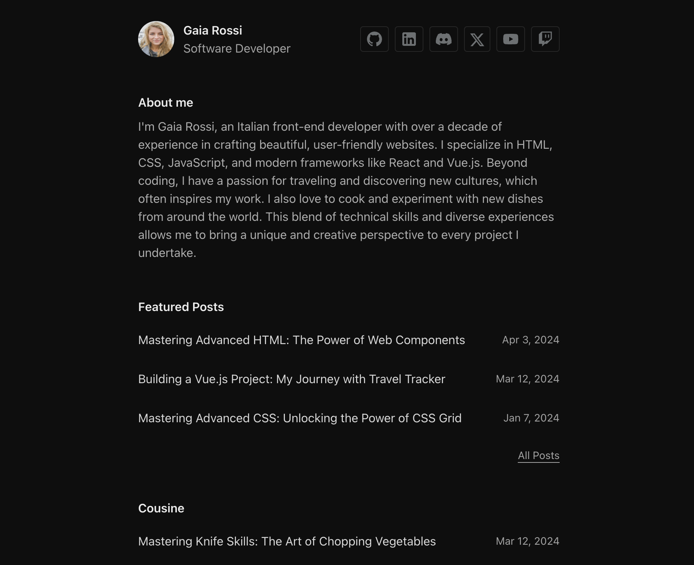

# AstroGaia: Template using Astro, Tailwind CSS, ReactJS and shadcn/ui.

AstroGaia is a single-author portfolio theme for Astro.js, mostly oriented to a software developer.



[](https://app.netlify.com/start/deploy?repository=https://github.com/danielecammarata/astro-gaia)

If you click this☝️ button, it will create a new repo for you that looks exactly like this one, and sets that repo up immediately for deployment on Netlify.

## Theme Features:

- ✅ Portfolio collection
- ✅ Post category support
- ✅ View transitions
- ✅ Tailwind CSS
- ✅ ReactJS
- ✅ shadcn/ui
- ✅ SEO-friendly with canonical URLs and OpenGraph data
- ✅ Sitemap support
- ✅ Markdown & MDX support
- ✅ Biome code linting and code formatting

## Template Integrations

- @astrojs/tailwind - https://docs.astro.build/en/guides/integrations-guide/tailwind/
- @astrojs/react - https://docs.astro.build/en/guides/integrations-guide/react/
- @astrojs/sitemap - https://docs.astro.build/en/guides/integrations-guide/sitemap/
- @astrojs/mdx - https://docs.astro.build/en/guides/markdown-content/
- shadcn/ui - https://ui.shadcn.com/
- Biome - https://biomejs.dev/

## Project Structure

Inside of Dante Astro theme, you'll see the following folders and files:

```text
├── public/
├── src/
│   ├── components/
│   ├── content/
│   ├── layouts/
│   ├── lib/
│   ├── pages/
│   └── styles/
├── astro.config.mjs
├── biome.json
├── components.json
├── package.json
├── README.md
├── tailwind.config.mjs
└── tsconfig.json
```

Astro looks for `.astro` or `.md` files in the `src/pages/` directory. Each page is exposed as a route based on its file name.

The `src/components/` is where we like to put any Astro (`.astro`) components, add shadcn/ui components, or custom ReactJs components.

The `src/content/` directory contains "collections" of related Markdown and MDX documents. Use `getCollection()` to retrieve posts from `src/content/blog/`, and type-check your frontmatter using an optional schema. See [Astro's Content Collections docs](https://docs.astro.build/en/guides/content-collections/) to learn more.

Any static assets, like images, can be placed in the `public/` directory.

## Astro.js Commands

All commands are run from the root of the project, from a terminal:

| Command                   | Action                                           |
| :------------------------ | :----------------------------------------------- |
| `npm install`             | Installs dependencies                            |
| `npm run dev`             | Starts local dev server at `localhost:4321`      |
| `npm run build`           | Build your production site to `./dist/`          |
| `npm run preview`         | Preview your build locally, before deploying     |
| `npm run astro ...`       | Run CLI commands like `astro add`, `astro check` |
| `npm run astro -- --help` | Get help using the Astro CLI                     |
| `npm check`               | Biome formatting and linting checks              |
| `npm write`               | Biome formatting and linting issues fix          |


## Credits

- Demo content generate with [Chat GPT](https://chat.openai.com/)
- Images for demo content from [Unsplash](https://unsplash.com/)

## 👀 Want to learn more?

Feel free to check [Astro documentation](https://docs.astro.build).
